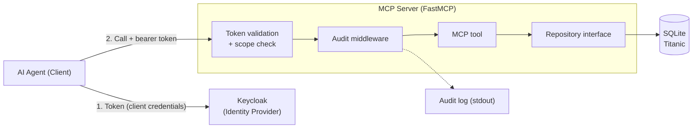

# MCP Database Server for AI Agents

An MCP server that gives AI agents **controlled, audited access** to a database
through business-level tools instead of raw SQL. Every call is authenticated,
authorized against tool-level scopes, and logged — so you always know which
agent read what, and when.

The dataset here is the public **Titanic** dataset (SQLite), standing in for
*sensitive data* (think insurance records): that sensitivity is what motivates
the authentication, access control, and auditability in the first place. The
one implemented tool, `get_survival_rate`, returns survival figures grouped by
passenger class or sex.

## Key engineering decisions

The interesting part of this project is not the tool — it's the boundaries
around it. I designed each decision below to keep the local proof-of-concept and
a future production deployment on the *same* architecture, so moving to the cloud
is a swap of implementations, not a rewrite.

### 1. A repository interface, not raw SQL

I made the server depend on a `TitanicRepository` **protocol** that exposes
domain-level operations (`get_survival_rate`), never a SQL string. The concrete
SQL backend, the in-memory test double, or a future DynamoDB implementation all
satisfy the same interface — so the storage engine is swappable without touching
server code. I kept the single piece of aggregation logic
(`GROUP BY ... avg(survived)`) *in the database*, where it belongs, rather than
pulling it into Python.

### 2. Authenticate at the edge, authorize in the server

Token **validation** can happen at the edge (in the PoC the server validates the
Keycloak token itself; in the cloud target an API gateway would). But I keep
**authorization** in the server, because only the server knows which tools and
data exist. It reads the agent's identity from the verified claims regardless of
who validated the token — so the authorization model stays stable from PoC to
production. Scopes are enforced at tool level: a base scope
every agent must carry (`titanic:access`) plus a per-tool scope
(`titanic:survival:read`), and the token's `audience` ties it to this specific
server so a token minted for another service in the same realm is rejected.

### 3. Auditing as a middleware layer

I made auditing a cross-cutting `AuditMiddleware`, not something each tool
remembers to call. It records *who* (the authenticated agent), *what* (tool +
query parameters), and *how long* — but never the result content or size, so the
audit trail never leaks the data it is meant to protect.

The server also exposes an unauthenticated `/health` endpoint for container
health checks and load-balancer probes — the container image uses it to report
readiness, and the example client waits on that before it calls the server.

### 4. What I deliberately left out (YAGNI)

- **No separate domain layer.** The only business logic is one SQL aggregation;
  a Python-side aggregation layer would throw away the database's strength and
  add nothing testable. It gets built when real DB-independent logic appears.
- **AWS deployment and agent lifecycle are conceptual only.** They are designed
  in [`docs/`](docs/index.md) but not implemented — the PoC's job is to prove
  the boundaries work end to end, locally.

## Architecture



**Stack:** Python · FastMCP (official Python MCP SDK) · SQLAlchemy behind the
repository interface (SQLite → PostgreSQL) · Keycloak (OAuth2/OIDC) · Docker
Compose · mkdocs-material for the docs.

## Run it locally

**Requirements:** Docker (incl. Compose v2) and `make`. For building the
[docs](#documentation) or developing outside the containers you also need
[uv](https://docs.astral.sh/uv/) and [pre-commit](https://pre-commit.com/)
(enable the hooks once with `pre-commit install`).

```bash
cp .env.example .env   # local config (dev defaults, no real secrets)
make up                # start Keycloak + MCP server (with build); logs stream to the console
make run-client        # run the example agent once against the server
```

`make` with no argument lists every command. `refresh` does a full restart from
scratch; `down` stops the containers and removes their volumes, so Keycloak's
realm state is discarded (a fresh `make up` re-imports it). The real `.env` is
git-ignored; if a required variable is missing, startup fails with a clear error.

The client fetches a token from Keycloak, calls the tool, and prints the result:

```text
Token received (scope='titanic:survival:read titanic:access')
Calling get_survival_rate(group_by='sex')
  sex='female' count=314 survival_rate=0.742
  sex='male'   count=577 survival_rate=0.189
```

In parallel, the server's audit middleware logs every call — with agent, tool,
and parameters:

```text
INFO  tool_call agent=example-agent tool=get_survival_rate args={'group_by': 'sex'} duration_ms=8.7
```

## Services & ports

`make up` starts two services, each bound to `127.0.0.1` only (not exposed
externally):

| Service        | Address                 | Purpose                                     |
| -------------- | ----------------------- | ------------------------------------------- |
| **MCP server** | `http://127.0.0.1:8000` | MCP endpoint (`/mcp/`), health (`/health`)  |
| **Keycloak**   | `http://127.0.0.1:8080` | Identity provider (token issuance, realm)   |

The example client is not long-running — it runs once via `make run-client`.

## Tests

The server tests run from the `server/` package against an in-memory
repository — no Docker or Keycloak required:

```bash
cd server && uv run pytest
```

## Documentation

The architecture and roadmap docs under [`docs/`](docs/index.md) are published as
a website with [mkdocs-material](https://squidfunk.github.io/mkdocs-material/):

```bash
make docs-serve        # serve the docs locally with live reload (on 127.0.0.1:8001)
```

`docs-serve` binds to port **8001** on purpose: mkdocs defaults to 8000, the
same port as the MCP server, so serving the docs on 8001 lets both run at once.

## Dataset

The Titanic dataset (891 passengers) comes from seaborn's built-in `titanic`
dataset (BSD-licensed), which derives from the public Kaggle/OpenML Titanic data.
It is checked in as a small SQLite file (`data/titanic.db`) so the demo runs with
zero setup.

---

*Originally built as a time-boxed coding challenge, then reworked into this
portfolio piece. The [docs](docs/index.md) walk through the design as a
four-step roadmap.*
