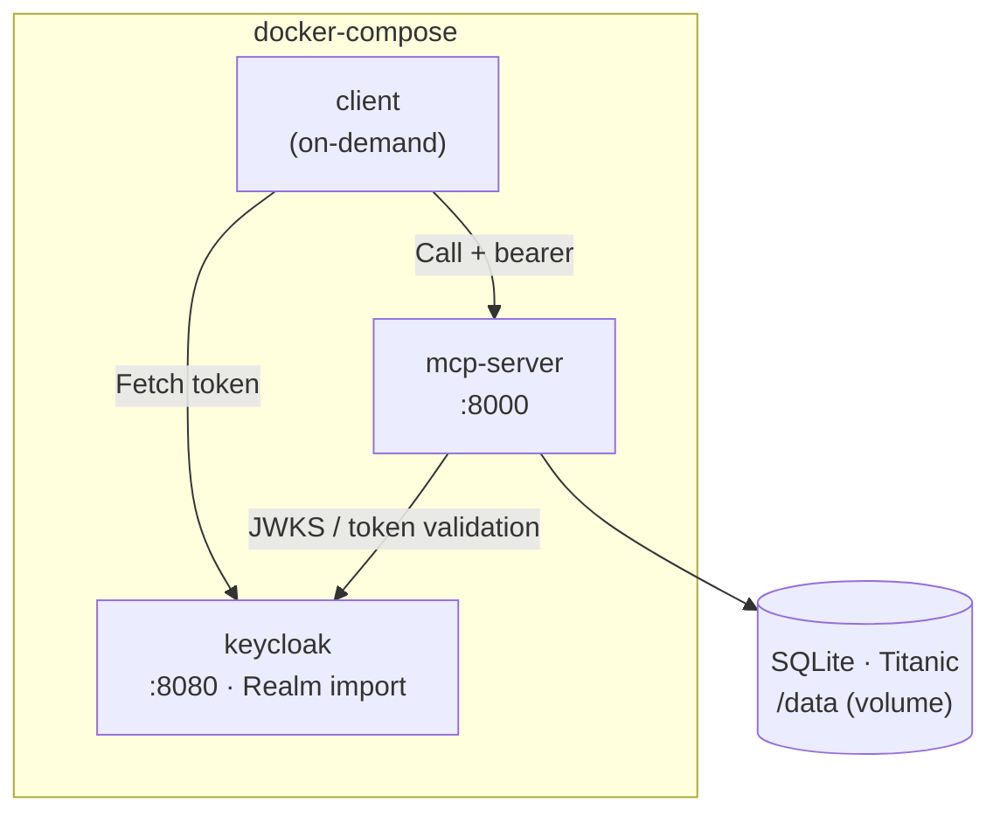

# Implementation Overview

Here is the implemented state: a local stack of three containers, orchestrated
with `docker-compose` and networked through **Docker service names**.

| Component | Function |
|------------|----------|
| **keycloak** | Identity provider; imports the versioned realm at startup. |
| **mcp-server** | Validates tokens, enforces scopes, audits, and accesses the database through the repository. |
| **client** | Example agent, runs on demand (`docker compose run --rm client`). |
| **SQLite** | Example database, mounted into the server as a read-only volume. |

## Request flow

1. The client fetches a token from Keycloak (**client credentials flow**, service account).
2. It calls the MCP tool with this token as a **bearer**.
3. The server **validates the token itself** (signature via JWKS, issuer, audience) and
   checks the required **scopes**.
4. On success, the tool runs the query against the database through the **repository**.
5. The **audit middleware** logs the call (agent, tool, parameters, duration) —
   but not the result content.

## Building blocks in detail

- [Repository & first tool](repository.md) — domain-level interface, SQLAlchemy, tool.
- [Keycloak & scopes](keycloak.md) — authentication, audience, scope enforcement.
- [Auditing](auditing.md) — middleware that logs every tool call.
