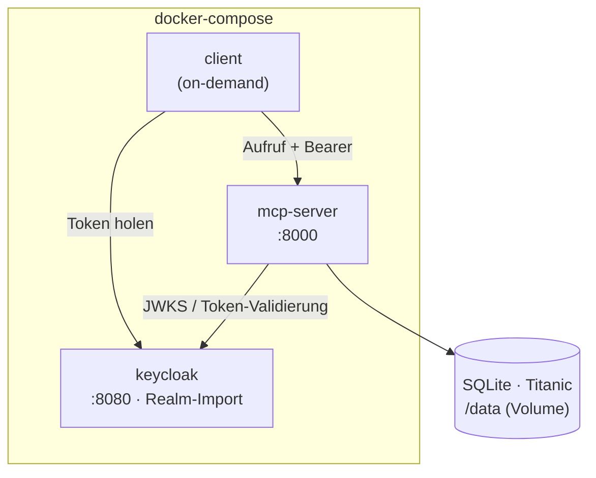

# Umsetzung im Überblick

So sieht der real umgesetzte Stand aus: ein lokaler Stack aus drei Containern, über
`docker-compose` orchestriert und per **Docker-Servicenamen** vernetzt.

| Komponente | Funktion |
|------------|----------|
| **keycloak** | Identity Provider; importiert beim Start den versionierten Realm. |
| **mcp-server** | Validiert Tokens, setzt Scopes durch, auditiert und greift über das Repository auf die Datenbank zu. |
| **client** | Beispiel-Agent, läuft auf Abruf (`docker compose run --rm client`). |
| **SQLite** | Beispieldatenbank, als read-only Volume in den Server gemountet. |

## Ablauf einer Anfrage

1. Der Client holt bei Keycloak ein Token (**Client-Credentials-Flow**, Service-Account).
2. Er ruft das MCP-Tool mit diesem Token als **Bearer** auf.
3. Der Server **validiert das Token selbst** (Signatur via JWKS, Issuer, Audience) und
   prüft die geforderten **Scopes**.
4. Bei Erfolg führt das Tool die Abfrage über das **Repository** gegen die Datenbank aus.
5. Die **Audit-Middleware** protokolliert den Aufruf (Agent, Tool, Parameter, Dauer) –
   ohne den Ergebnis-Inhalt.

## Bausteine im Detail

- [Repository & erstes Tool](repository.md) – fachliches Interface, SQLAlchemy, Tool.
- [Keycloak & Scopes](keycloak.md) – Authentifizierung, Audience, Scope-Durchsetzung.
- [Auditing](auditing.md) – Middleware, die jeden Tool-Aufruf protokolliert.
