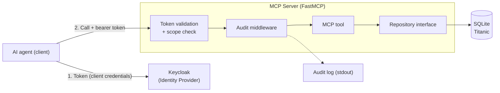

---
hide:
  - navigation
  - toc
---

# MCP Server for AI Agents

## The problem

An **MCP server** that serves data from a **database** to AI agents through
standardized MCP tools. Different agents use the server as a tool to query that
data — but never touch the database directly.

**Note:** The example uses the well-known **Titanic** dataset, available as a
**SQLite** database. Throughout this project I treat that dataset as a stand-in
for **sensitive data** (think insurance records) — which is what creates the need
for authentication, access control, and auditability in the first place.

## Guiding questions

Reading the problem, these questions came to mind right away — and they structure
the topics and the roadmap (see the navigation above):

- How do I ensure agents can only access the data they are authorized for?
- How do I keep a record of which agent queried what, and when?
- How do I design database access so other database systems (e.g. PostgreSQL,
  DynamoDB) can be plugged in later?
- How do we deploy the server to AWS so it stays scalable and available under
  load?
- How do I handle onboarding and offboarding of agents — fast access for new
  ones, reliable revocation for decommissioned ones?

## Scope of this solution

The focus is a **working local proof of concept** that demonstrates the central
questions in practice.

**Implemented in this PoC:**

- MCP server with a first read-only tool
- swappable database access behind a repository interface
- authentication and access control at the tool level (scopes)
- auditing of every tool call

**Deliberately conceptual only** (see Topics):

- production deployment on AWS ([Infrastructure & operations](topics/infrastructure-operations.md))
- agent lifecycle management ([Agent lifecycle](topics/agent-lifecycle.md))

## Architecture & stack

The agent first fetches a token from Keycloak, then calls the tool with it. The
server validates the token itself, checks the scopes, runs the tool against the
database through the repository, and logs the call.

The technologies behind these building blocks:

- **Language**: Python
- **MCP framework**: FastMCP (official Python MCP SDK)
- **DB abstraction**: repository pattern over SQLAlchemy (SQLite → PostgreSQL)
- **AuthN/AuthZ**: Keycloak (OAuth2/OIDC), scopes at the tool level first

## Roadmap (4 steps)

The order is deliberate: each step delivers value on its own and lays the
groundwork for the next.

| Step | Topic | Result |
|------|-------|--------|
| 1 | [Client + server over HTTP](roadmap/01-fastmcp.md) | Working skeleton: MCP client and server over HTTP |
| 2 | [Repository pattern](roadmap/02-repository-pattern.md) | Database access behind a domain-level interface, swappable DB, first read-only tool |
| 3 | [Keycloak & scopes](roadmap/03-keycloak-scopes.md) | OAuth2/OIDC access control, scopes at the tool level first, introduces agent identity |
| 4 | [Auditing layer](roadmap/04-auditing.md) | Logging of every request per agent (uses the Keycloak identity) |
