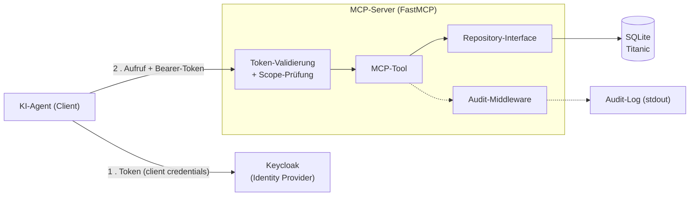

---
hide:
  - navigation
  - toc
---

# Coding Challenge - MCP-Server für KI-Agenten

## Aufgabenstellung

Es soll ein **MCP-Server** implementiert werden, der Daten aus einer **Datenbank** über
standardisierte MCP-Tools für KI-Agenten bereitstellt. Verschiedene Agents nutzen den
Server als Werkzeug, um diese Daten abzufragen.

**Hinweis**: Testweise wird der bekannte **Titanic-Datensatz** verwendet, der als **SQLite**-Datenbank
vorliegt. Für dieses Projekt gehe ich davon aus, dass dieser Datensatz stellvertretend für
**sensible Daten** steht (z.B. Versichertendaten) – daraus ergibt sich der Bedarf an
Authentifizierung, Zugriffskontrolle und Nachvollziehbarkeit.

## Erste Fragen

Beim Lesen der Aufgabenstellung kamen mir direkt diese Fragen in den Sinn:

- Wie stelle ich sicher, dass Agents nur auf die Daten zugreifen können, für die sie
  berechtigt sind?
- Wie halte ich fest, welcher Agent wann welche Daten abgefragt hat?
- Wie gestalte ich den Datenbankzugriff so, dass sich später andere Datenbanksysteme
  (z.B. PostgreSQL, DynamoDB) anbinden lassen?
- Wie stellen wir den Server produktiv auf AWS bereit, sodass er auch bei hoher
  Last skalierbar und verfügbar bleibt?
- Wie gestalte ich Onboarding und Offboarding von Agents – schneller Zugriff für neue,
  zuverlässige Sperrung für abgekündigte?

Diese Fragen strukturieren die Themenbereiche und die Roadmap (siehe Navigation oben).

## Umfang dieser Lösung

Aufgrund der begrenzten Bearbeitungszeit liegt der Fokus auf einem **lauffähigen lokalen
Proof of Concept**, der die zentralen Fragen praktisch demonstriert.

**Im Rahmen dieses POC soll umgesetzt werden:**

- MCP-Server mit einem ersten lesenden Tool
- austauschbarer Datenbankzugriff über ein Repository-Interface
- Authentifizierung und Zugriffskontrolle auf Tool-Ebene (Scopes)
- Auditing sämtlicher Tool-Aufrufe

**Bewusst nur konzeptionell** (siehe Themen):

- produktive Bereitstellung auf AWS ([Infrastruktur & Betrieb](topics/infrastructure-operations.md))
- Agent-Lifecycle-Management ([Agent-Lifecycle](topics/agent-lifecycle.md))

## Architektur & Stack

Der Agent holt zunächst ein Token bei Keycloak und ruft das Tool dann mit diesem Token auf.
Der Server validiert das Token selbst, prüft die Scopes, führt das Tool über das
Repository gegen die Datenbank aus und protokolliert den Aufruf.

Die eingesetzten Technologien hinter diesen Bausteinen:

- **Sprache**: Python
- **MCP-Framework**: FastMCP (offizielles Python-MCP-SDK)
- **DB-Abstraktion**: Repository Pattern, darunter SQLAlchemy (SQLite → PostgreSQL)
- **AuthN/AuthZ**: Keycloak (OAuth2/OIDC), Scopes zunächst auf Tool-Ebene

## Roadmap (4 Schritte)

Die Reihenfolge ist bewusst gewählt: Jeder Schritt liefert für sich Mehrwert und legt
die Grundlage für den nächsten.

| Schritt | Thema | Ergebnis |
|--------|-------|----------|
| 1 | [Client + Server über HTTP](roadmap/01-fastmcp.md) | Lauffähige Grundstruktur: MCP-Client und -Server über HTTP |
| 2 | [Repository Pattern](roadmap/02-repository-pattern.md) | Datenbankzugriff hinter fachlichem Interface, DB austauschbar, erstes lesendes Tool |
| 3 | [Keycloak & Scopes](roadmap/03-keycloak-scopes.md) | OAuth2/OIDC-Zugriffskontrolle, Scopes zunächst auf Tool-Ebene, führt die Agent-Identität ein |
| 4 | [Auditing Layer](roadmap/04-auditing.md) | Protokollierung aller Anfragen pro Agent (nutzt die Keycloak-Identität) |
